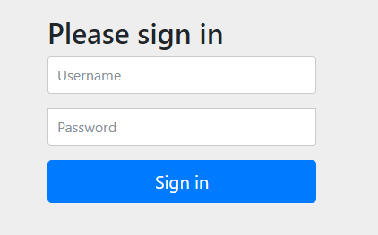
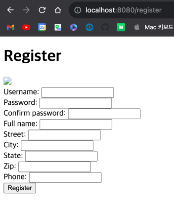

# 5. Securing Spring

1. Enable Spring Security
2. Configuring authentication
3. Securing web requests
4. Applying method-level security
5. Knowing your user
6. Summary

> ### This chapter covers
>
> - Spring Security 자동 설정
> - custom user storage
> - login page
> - CSRF attack 대응
> - user 식별

---

## 1. Enable Spring Security

```xml

<dependency>
    <groupId>org.springframework.boot</groupId>
    <artifactId>spring-boot-starter-security</artifactId>
</dependency>
```

```groovy
dependencies {
    implementation 'org.springframework.boot:spring-boot-starter'
    implementation 'org.springframework.boot:spring-boot-starter-web'
    implementation 'org.springframework.boot:spring-boot-starter-security'
}
```

```
...
Using generated security password: ffce4499-286d-4972-acd4-38257e05f1ba

This generated password is for development use only. Your security configuration must be updated before running your application in production.
...
```



#### Spring Security AutoConfiguration

- 모든 HTTP 요청에 authentication 추가
- 특정 role, authority 필요 없음
- 로그인 페이지로 Authentication 수행
- 사용자는 `user` 한명

## 2. Configuring authentication

- xml, java config 으로 가능 (최근에는 java config 추천, 가독성)

```java
import org.springframework.context.annotation.Bean;
import org.springframework.context.annotation.Configuration;
import org.springframework.security.crypto.bcrypt.BCryptPasswordEncoder;
import org.springframework.security.crypto.password.PasswordEncoder;

@Configuration
public class SecurityConfig {

    // 인증 시 사용할 PasswordEncoder 를 Bean 으로 등록
    @Bean
    public PasswordEncoder passwordEncoder() {
        return new BCryptPasswordEncoder();
    }
}

```

- DB의 PWD 를 복호화하지 않음
- 사용자가 입력한 PWD를 동일한 알고리즘 (`BCryptPasswordEncoder`) 으로 암호화하여 비교 (`PasswordEncoder.matches()`)

#### user store 구현 (in-memory)

```java
package com.example.inaction.service;

import org.springframework.security.core.userdetails.UserDetails;
import org.springframework.security.core.userdetails.UsernameNotFoundException;

public interface UserDetailService {

    // username으로 UserDetails 객체를 탐색, 없으면 UsernameNotFoundException 발생
    UserDetails loadUserByUsername(String username) throws UsernameNotFoundException;
}

```

### 2.1 In-memory user details service

- 사용자 정보가 저장될 in-memory user store 구현

```
@Bean
public UserDetailService userDetailService() {
    List<UserDetails> users = new ArrayList<>();
    // 인증할 user 정보가 2명일 때
    users.add(new User("user01", passwordEncoder().encode("pwd01")
            , Arrays.asList(new SimpleGrantedAuthority("ROLE_USER"))));
    users.add(new User("user02", passwordEncoder().encode("pwd02")
            , Arrays.asList(new SimpleGrantedAuthority("ROLE_USER"))));
    return new InMemoryUserDetailsManager(users);
}
```

### 2.2 Customizing user authentication

- 데이터를 RDB에 보관

#### DEFINING THE USER DOMAIN AND PERSISTENCE

```java
import jakarta.persistence.Entity;
import jakarta.persistence.GeneratedValue;
import jakarta.persistence.GenerationType;
import jakarta.persistence.Id;
import lombok.*;
import org.springframework.security.core.GrantedAuthority;
import org.springframework.security.core.authority.SimpleGrantedAuthority;
import org.springframework.security.core.userdetails.UserDetails;

import java.util.Arrays;
import java.util.Collection;

@Entity
@Data
@NoArgsConstructor(access = AccessLevel.PRIVATE, force = true) // force=true: final 필드를 초기화하는 생성자를 생성
@RequiredArgsConstructor // final 필드를 위한 생성자를 생성
@ToString
public class User implements UserDetails {

    private static final long serialVersionUID = 1L;

    @Id
    @GeneratedValue(strategy = GenerationType.AUTO)
    private Long id;

    private final String username;
    private final String password;
    private final String fullname;
    private final String street;
    private final String city;
    private final String state;
    private final String zip;
    private final String phoneNumber;

    // user에게 부여된 권한을 반환
    @Override
    public Collection<? extends GrantedAuthority> getAuthorities() {
        return Arrays.asList(new SimpleGrantedAuthority("ROLE_USER"));
    }

    // user가 만료되지 않았는지
    @Override
    public boolean isAccountNonExpired() {
        return true;
    }

    // user가 잠겨있지 않은지 
    @Override
    public boolean isAccountNonLocked() {
        return true;
    }

    // user의 credentials가 만료되지 않았는지
    @Override
    public boolean isCredentialsNonExpired() {
        return true;
    }

    // user가 활성화되었는지
    @Override
    public boolean isEnabled() {
        return true;
    }

}


```

```java
import com.example.inaction.entity.User;
import org.springframework.data.repository.CrudRepository;

public interface UserRepository extends CrudRepository<User, Long> {

    User findByUsername(String username);
}

```

- `org.springframework.data.repository.CrudRepository` : CRUD 기능을 제공하는 인터페이스
    - Spring Data JPA가 자동으로 구현체를 runtime에 생성
- `findByUsername()` : username으로 user를 찾는 메서드

#### CREATING A USER DETAILS SERVICE

```java
package com.example.inaction.config;

import com.example.inaction.entity.User;
import com.example.inaction.repo.UserRepository;
import org.springframework.context.annotation.Bean;
import org.springframework.context.annotation.Configuration;
import org.springframework.security.core.userdetails.UserDetailsService;
import org.springframework.security.core.userdetails.UsernameNotFoundException;
import org.springframework.security.crypto.bcrypt.BCryptPasswordEncoder;
import org.springframework.security.crypto.password.PasswordEncoder;

@Configuration
public class SecurityConfig {
    // ...

    @Bean
    public UserDetailsService userDetailsService(UserRepository userRepo) {

        // UserDetailsService 인터페이스의 loadUserByUsername() 메서드를 구현
        return username ->
                Optional.ofNullable(userRepo.findByUsername(username))
                        .orElseThrow(() ->
                                new UsernameNotFoundException("User '" + username + "' not found"));
    }
}

```

#### REGISTERING USERS

- 사용자 등록은 Spring MVC를 통해
- /registerForm 에 login 없이 접근 불가능

```java
import com.example.inaction.config.RegistrationForm;
import com.example.inaction.repo.UserRepository;
import org.springframework.security.crypto.password.PasswordEncoder;
import org.springframework.web.bind.annotation.GetMapping;
import org.springframework.web.bind.annotation.PostMapping;
import org.springframework.web.bind.annotation.RequestMapping;

@org.springframework.stereotype.Controller
@RequestMapping("/register")
public class Controller {

    private UserRepository userRepo;
    private PasswordEncoder passwordEncoder;

    public Controller(UserRepository userRepo, PasswordEncoder passwordEncoder) {
        this.userRepo = userRepo;
        this.passwordEncoder = passwordEncoder;
    }

    @GetMapping
    public String registerForm() {
        return "registration";
    }

    @PostMapping
    public String processRegistration(RegistrationForm form) {
        userRepo.save(form.toUser(passwordEncoder));
        return "redirect:/login";
    }
}
```

````java
package com.example.inaction.config.security;

import com.example.inaction.entity.User;
import lombok.Data;
import org.springframework.security.crypto.password.PasswordEncoder;

@Data
public class RegistrationForm {
    private String username;
    private String password;
    private String fullname;
    private String street;
    private String city;
    private String state;
    private String zip;
    private String phone;

    public User toUser(PasswordEncoder passwordEncoder) {
        return new User(
                username, passwordEncoder.encode(password),
                fullname, street, city, state, zip, phone);
    }
}

````

## 3. Securing web requests

- 권한이 필요없는 페이지 : login, home, register
- `SecurityFilterChain` bean으로 구성

````
@Bean
public SecurityFilterChain filterChain(HttpSecurity http) throws Exception {
    return http.build();
}
````

#### Configuring the HttpSecurity

- web level에서 동작할 security 설정
- request를 처리하기 전에 특정 security 조건
- custom login page
- application logout 허가
- cross-site request forgery 허가

### 3.1 Securing requests

```java
import org.springframework.context.annotation.Bean;
import org.springframework.context.annotation.Configuration;
import org.springframework.security.config.annotation.web.builders.HttpSecurity;
import org.springframework.security.crypto.bcrypt.BCryptPasswordEncoder;
import org.springframework.security.crypto.password.PasswordEncoder;
import org.springframework.security.web.SecurityFilterChain;

@Configuration
public class SecurityConfig {

    // ...

    @Bean
    public SecurityFilterChain filterChain(HttpSecurity http) throws Exception {
        return http
                .authorizeRequests()
                .requestMatchers("/design", "/orders").hasRole("USER") // /design, /orders 경로에 대한 요청은 USER 권한이 있어야 함
                .requestMatchers("/", "/**").permitAll() // /, /** 경로에 대한 요청은 모두 허용
                .and()
                .build();
    }
}

```

- 순서 중요 : 먼저 선언된 것이 우선순위가 높음

| Method                       | Description                        |
|------------------------------|------------------------------------|
| `access(String)`             | 표현식을 (SpEL) 사용하여 특정 요청에 대한 접근을 제한  |
| `anonymous()`                | 익명 사용자에 대한 접근을 제한                  |
| `authenticated()`            | 인증된 사용자에 대한 접근을 제한                 |
| `denyAll()`                  | 모든 접근을 거부                          |
| `fullyAuthenticated()`       | 완전히 인증된 사용자에 대한 접근을 제한             |
| `hasAnyAuthority(String...)` | 주어진 권한 중 하나 이상을 가진 사용자에 대한 접근을 제한  |
| `hasAnyRole(String...)`      | 주어진 역할 중 하나 이상을 가진 사용자에 대한 접근을 제한  |
| `hasAuthority(String)`       | 주어진 권한을 가진 사용자에 대한 접근을 제한          |
| `hasIpAddress(String)`       | 주어진 IP 주소를 가진 사용자에 대한 접근을 제한       |
| `hasRole(String)`            | 주어진 역할을 가진 사용자에 대한 접근을 제한          |
| `not()`                      | 다른 접근 제한 메서드의 결과를 부정               |
| `permitAll()`                | 모든 접근을 허용                          |
| `rememberMe()`               | remember-me 인증을 사용한 사용자에 대한 접근을 제한 |

#### SpEL (Spring Expression Language)

- SpEL을 사용해 더 유연하게 표현식을 사용할 수 있음

```java
import org.springframework.context.annotation.Bean;
import org.springframework.context.annotation.Configuration;
import org.springframework.security.config.annotation.web.builders.HttpSecurity;
import org.springframework.security.crypto.bcrypt.BCryptPasswordEncoder;
import org.springframework.security.crypto.password.PasswordEncoder;
import org.springframework.security.web.SecurityFilterChain;

@Configuration
public class SecurityConfig {

    // ...

    @Bean
    public SecurityFilterChain filterChain(HttpSecurity http) throws Exception {
        return http
                .authorizeRequests()
                .antMatchers("/design", "/orders").access("hasRole('USER')")
                .antMatchers("/", "/**").access("permitAll()")
                .and()
                .build();
    }
}

```



```java
import org.springframework.context.annotation.Bean;
import org.springframework.context.annotation.Configuration;
import org.springframework.security.config.annotation.web.builders.HttpSecurity;
import org.springframework.security.crypto.bcrypt.BCryptPasswordEncoder;
import org.springframework.security.crypto.password.PasswordEncoder;
import org.springframework.security.web.SecurityFilterChain;

@Configuration
public class SecurityConfig {

    // ...

    @Bean
    public SecurityFilterChain filterChain(HttpSecurity http) throws Exception {
        return http
                .authorizeRequests()
                .antMatchers("/design", "/orders")
                .access("hasRole('USER') && " +
                        "T(java.util.Calendar).getInstance().get(" +
                        "T(java.util.Calendar).DAY_OF_WEEK) == " +
                        "T(java.util.Calendar).TUESDAY") // 화요일에만 /design, /orders 경로에 대한 요청을 허용
                .antMatchers("/", "/**").access("permitAll")
                .and()
                .build();
    }
}

```

### 3.2 Creating a custom login page

- `fromLogin()` : login page를 보여주는 GET 요청을 처리

```java
package com.example.inaction.config.security;

import org.springframework.context.annotation.Bean;
import org.springframework.context.annotation.Configuration;
import org.springframework.security.config.annotation.web.builders.HttpSecurity;
import org.springframework.security.web.SecurityFilterChain;

@Configuration
public class SecurityConfig {

    @Bean
    public SecurityFilterChain filterChain(HttpSecurity http) throws Exception {
        return http
                .authorizeRequests()
                .requestMatchers("/design", "/orders").hasRole("USER") // /design, /orders 경로에 대한 요청은 USER 권한이 있어야 함
                .requestMatchers("/", "/**").permitAll() // /, /** 경로에 대한 요청은 모두 허용
                .and()
                .formLogin((formLogin) ->
                        formLogin.loginPage("/login") // 로그인 페이지 경로
                                .defaultSuccessUrl("/something_after_login") // 로그인 성공 시 이동할 경로
                ).logout((logout) ->
                        logout.logoutSuccessUrl("/login") // 로그아웃 성공 시 이동할 경로 (default: home)
                                .invalidateHttpSession(true) // 로그아웃 시 세션 무효화
                )
                .build();
    }
}

```

```java

package com.example.inaction.config;

import org.springframework.context.annotation.Configuration;
import org.springframework.web.servlet.config.annotation.ViewControllerRegistry;
import org.springframework.web.servlet.config.annotation.WebMvcConfigurer;

@Configuration
public class WebConfig implements WebMvcConfigurer {

    // view controller를 등록
    @Override
    public void addViewControllers(ViewControllerRegistry registry) {
        registry.addViewController("/").setViewName("home");
        registry.addViewController("/login"); // login.html을 렌더링하는 컨트롤러를 추가
    }
}
```

- `/login`에 대한 Request를 처리할 수 있는 controller 등록
- 기본적으로 Spring Security는 `/login` 으로부터 요청되는 login form에 대해 `username`과 `password`를 기대
    - cutomizing 가능

```java
package com.example.inaction.config;

import org.springframework.context.annotation.Bean;
import org.springframework.context.annotation.Configuration;
import org.springframework.security.config.annotation.web.builders.HttpSecurity;
import org.springframework.security.crypto.bcrypt.BCryptPasswordEncoder;
import org.springframework.security.crypto.password.PasswordEncoder;
import org.springframework.security.web.SecurityFilterChain;

@Configuration
public class SecurityConfig {

    @Bean
    public PasswordEncoder passwordEncoder() {
        return new BCryptPasswordEncoder();
    }


    @Bean
    public SecurityFilterChain filterChain(HttpSecurity http) throws Exception {
        return http
                .authorizeRequests()
                .requestMatchers("/design", "/orders").hasRole("USER") // /design, /orders 경로에 대한 요청은 USER 권한이 있어야 함
                .requestMatchers("/", "/**").permitAll() // /, /** 경로에 대한 요청은 모두 허용
                .and()
                .formLogin((formLogin) ->
                        formLogin.loginPage("/login") // 로그인 페이지 경로
                                .defaultSuccessUrl("/something_after_login") // 로그인 성공 시 이동할 경로
                                .usernameParameter("ex_user_name") // custom username 파라미터명
                                .passwordParameter("ex_password") // custom password 파라미터명
                ).logout((logout) ->
                        logout.logoutSuccessUrl("/login") // 로그아웃 성공 시 이동할 경로
                                .invalidateHttpSession(true) // 로그아웃 시 세션 무효화
                )
                .build();
    }
}

```

### 3.3 Enabling third-party authentication

- sign in with Google, Facebook 등
- OAuth2, OpenID Connect 기반

```xml

<dependency>
    <groupId>org.springframework.boot</groupId>
    <artifactId>spring-boot-starter-oauth2-client</artifactId>
</dependency>
```

```yaml
spring:
  security:
  oauth2:
  client:
  registration:
  <oauth2 or openid provider name>:
  clientId: <client id>
  clientSecret: <client secret>
  scope: <comma-separated list of requested scopes>
```

```html
<a th:href="/oauth2/authorization/google">Sign in with Google</a>
```

````
@Bean
public SecurityFilterChain filterChain(HttpSecurity http) throws Exception {
    return http
        .authorizeRequests()
        .mvcMatchers("/design", "/orders").hasRole("USER")
        .anyRequest().permitAll()
        .and()
            .formLogin().loginPage("/login")
        .and()
            .oauth2Login() // OAuth2 로그인 활성화
            .loginPage("/oauth2/authorization/google") // OAuth2 로그인 시도 시 이동할 경로 (e.g. /oauth2/authorization/google)
        ...
        .and()
            .logout() // 로그아웃 활성화
            .logoutSuccessUrl("/login") // 로그아웃 성공 시 이동할 경로
        .build();
}
````

- `clientId` : OAuth2 provider에서 발급한 client id
- `scope` : OAuth2 provider에게 요청할 권한

### 3.4 Preventing cross-site request forgery

- CSRF : 악의적인 사용자가 사용자의 권한을 이용해 서버에 요청하는 것
- e.g. 사용자에게 공격자의 website를 노출하고 자동으로 post 요청하게만듦
    - post 요청 : 은행으로 송금 요청 등
- 해결방안 : CSRF token 사용
    - 서버는 CSRF token을 생성하여 사용자에게 전달 (hidden field, cookie)
    - 사용자는 서버로부터 전달받은 CSRF token을 요청에 포함시켜 전송
- Spring Security 는 built-in CSRF protection 제공
    - `_csrf` 라는 이름의 hidden field를 생성 (thymeleaf 사용 시 자동 생성)

```html
<input type="hidden" name="_csrf" th:value="${_csrf.token}"/>
```

```html
<!-- th:action 을 사용하면 자동으로 CSRF token을 hidden field로 생성 -->
<form method="POST" th:action="@{/login}" id="loginForm">
```

````
.and()
 .csrf()
 .disable() // CSRF 보호 비활성화 (절대 비추!!)
````

## 4. Applying method-level security

```java

@Controller
@RequestMapping("/admin")
public class AdminController {
    private OrderAdminService adminService;

    public AdminController(OrderAdminService adminService) {
        this.adminService = adminService;
    }

    @PostMapping("/deleteOrders")
    public String deleteAllOrders() {
        adminService.deleteAllOrders(); // 이 메서드가 다른 Controller에서도 호출될 수 있을 텐데?
        return "redirect:/admin";
    }
}
```

```
@Configuration
@EnableGlobalMethodSecurity // 메서드에 대한 security 설정을 활성화
public class SecurityConfig extends WebSecurityConfigurerAdapter {
 ...
}

...

// 메서드에 대한 security 설정
@PreAuthorize("hasRole('ADMIN')") // ADMIN 권한이 있어야만 메서드가 수행됨
public void deleteAllOrders() {
    orderRepository.deleteAll();
}

@PostAuthorize("hasRole('ADMIN') || " +
 "returnObject.user.username == authentication.name") // ADMIN 권한이 있거나, 현재 사용자가 주문한 것이라면 메서드가 수행됨 
public TacoOrder getOrder(long id) {
 ...
}
```

- `@PreAuthorize` : 메서드가 호출되기 전에 security check 수행
    - SpEL 사용
    - return true일 때만, 메서드가 수행됨
    - return false -> `AccessDeniedException` 발생
        - -> 403 Forbidden 응답 (추가 구현)
- `@PostAuthorize` : 메서드가 호출된 후에 security check 수행

## 5. Knowing your user

## 6. Summary
